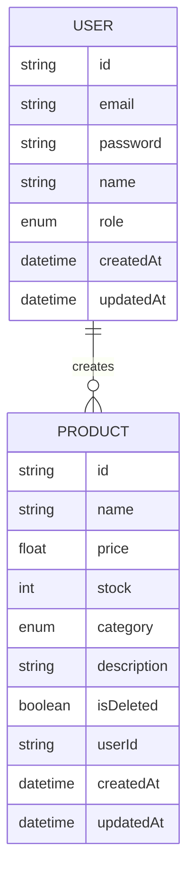

# store-management-api

A RESTful API for managing products and users with authentication, role-based access control, validation, pagination, and soft delete. Built using Express, Prisma, and PostgreSQL.

## Features

- User authentication (Register & Login with JWT)
- Role-based access control (USER, ADMIN, SUPERADMIN)
- Product Management (CRUD)
- Filter by product category
- Search product by name
- Input validation using Zod
- Pagination for product list
- Soft delete
- Prisma ORM with PostgreSQL
- Error handling (including Prisma errors like duplicate email)

## ERD Diagram

## Roles & Permissions

### USER

- Create product
- View own products
- Update & delete own products

### ADMIN

- View all products
- Update & delete any product
- View all users

### SUPERADMIN

- Full access to all resources
- Manage user roles

## Tech Stack

- Node.js
- Express.js
- Prisma ORM
- PostgreSQL
- Zod (validation)

## Project Structure

src/
├── controllers/
├── routes/
├── middlewares/
├── validations/
├── utils/
├── prisma/

## Installation

1. Clone repository
   git clone https://github.com/username/project-name.git

2. Install dependencies
   npm install

3. Setup environment variables
   Create `.env` file:
   DATABASE_URL="your_database_url"

4. Run migration
   npx prisma migrate dev

5. Start server
   npm run dev

## API Endpoints

### Auth

POST /auth/register
POST /auth/login
POST /auth/logout

### Products

GET /products
GET /products/:id
POST /products
PUT /products/:id
DELETE /products/:id

## Query Features

- Pagination: ?page=1&limit=10
- Search: ?search=keyboard
- Category filter: ?category=FOOD

## Testing

Tested manually using Postman.

## Notes

- Soft delete is implemented using `isDeleted` flag
- All product queries exclude deleted items

Some features are still in progress:

- Advanced validation (edge cases like whitespace input)
- Role management improvements
- Authorization refinement

## Author

Built as part of backend learning journey,
by Sarah Nur Haibah
