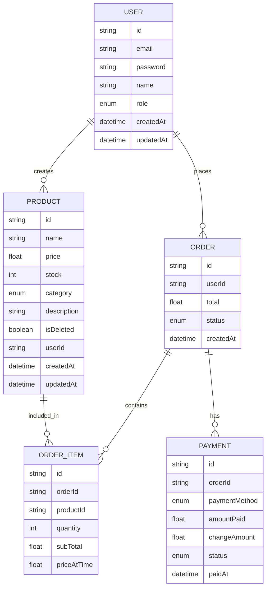
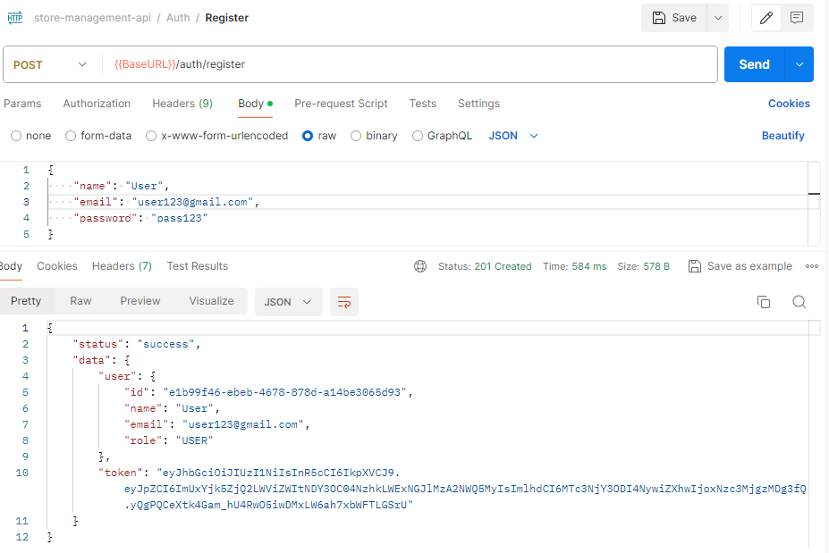
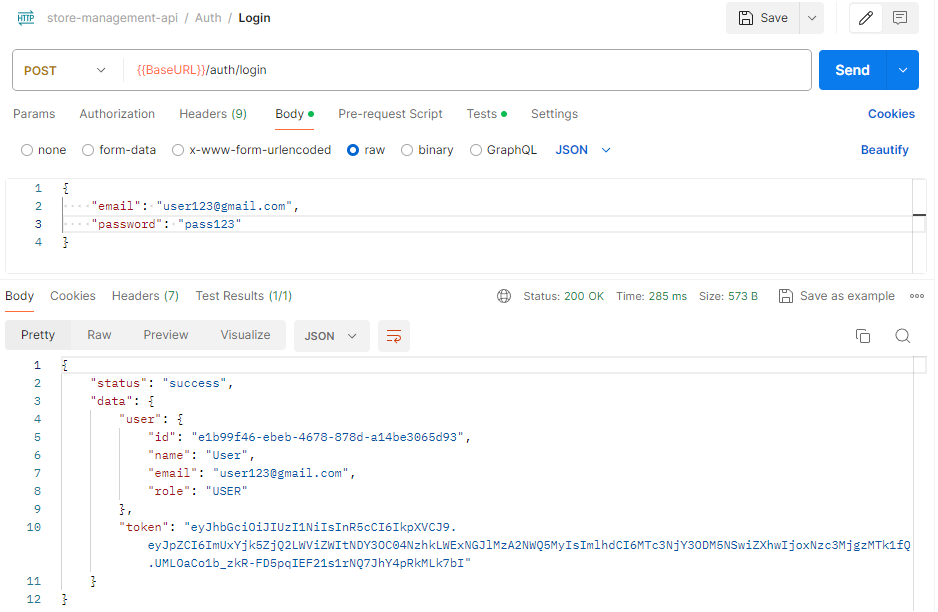
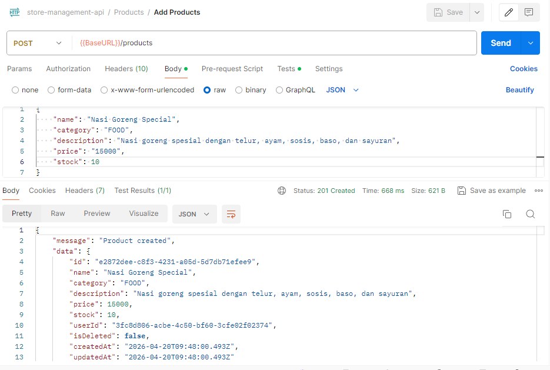
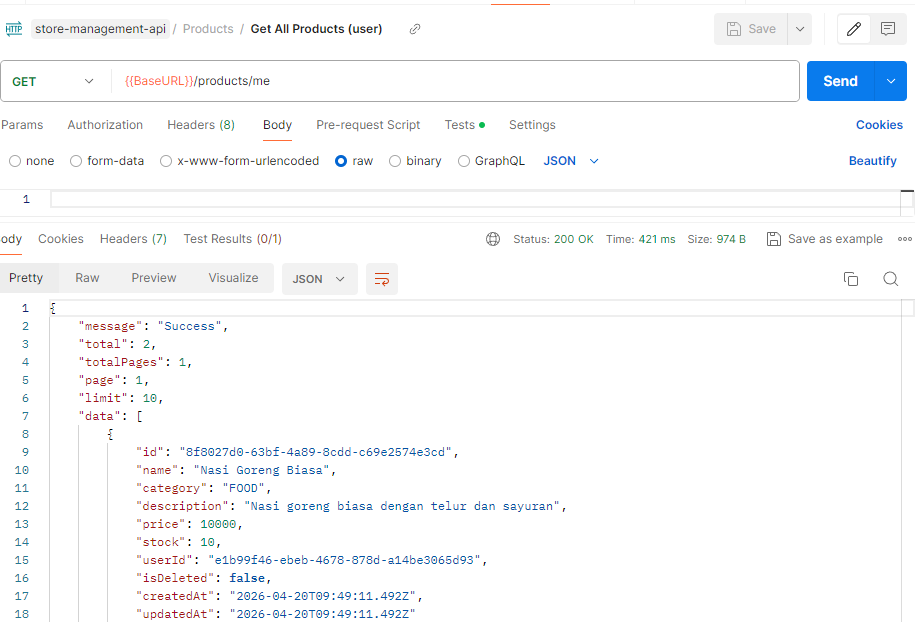
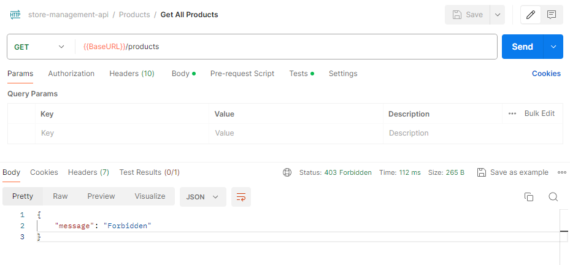

# Store Management & Transaction API

A backend API for managing products and handling simple transaction flows (cash-based), built with Node.js, Express, Prisma, and PostgreSQL.

## Features
### Authentication & Authorization
- User authentication (Register & Login with JWT)
- Role-based access (USER, ADMIN, SUPERADMIN)
  
### Product Management
- Create, update, delete products
- Ownership-based access control
- Filter by category
- Search (case-insensitive & partial)
- Pagination
- Soft delete 

### Order Management (Transaction Flow)
- Create empty order
- Add items to order
- Update item quantity
- Remove items from order
- Automatically calculate subtotal & total price
- Prevent duplicate items (update instead of create)

### Payment (Cash Only)
- Designed for simple POS-like flow
- Payment handled as part of transaction flow
- Calculates total and change amount

## Transaction Flow
- Create empty order
- Add product(s) to order
- System will:
  - Validate product & stock
  - Store priceAtTime
  - Calculate subTotal
  - Update order total
- Update or remove items if needed
- Final order reflects total transaction value

## Tech Stack

- Node.js
- Express.js
- Prisma ORM
- PostgreSQL
- Zod (validation)
- JWT (authentication)

## Project Structure

```
src/
├── controllers/
├── routes/
├── middlewares/
├── validations/
├── utils/
├── prisma/
```

## ERD Diagram



## API Endpoints

### Auth
- POST /auth/register    -> Register new user
- POST /auth/login       -> Login user
- POST /auth/logout      -> Logout user

### Products
- GET /products          -> Get all products (Admin)
- GET /products/me       -> Get user products
- GET /products/:id      -> Get product detail
- POST /products         -> Create product
- PUT /products/:id      -> Update product
- DELETE /products/:id   -> Delete product (soft delete)

### Orders
- POST /orders                          -> Create empty order
- POST /orders/:orderId/items           -> Add item to order
- PATCH /orders/:orderId/items/:itemId  -> Update item quantity
- DELETE /orders/:orderId/items/:itemId -> Remove item
- POST /orders/:orderId/checkout        -> Checkout Order
- GET /orders/:id                       -> Get order detail

## Query Features

- Pagination: ?page=1&limit=10
- Search: ?search=nasi
- Category filter: ?category=FOOD

## Roles & Permissions

### USER

- Create product
- View own products
- Update & delete own products

### ADMIN

- View all products
- Update & delete any product
- View all users

### SUPERADMIN

- Full access to all resources
- Manage user roles


## Installation

1. Clone repository
   git clone https://github.com/username/project-name.git

2. Install dependencies
   npm install

3. Setup environment variables
   Create `.env` file:
   DATABASE_URL="your_database_url"

4. Run migration
   npx prisma migrate dev

5. Start server
   npm run dev


## Testing

Tested manually using Postman

### Register



### Login



### Create Product



### My Products



### Forbidden Access



## Notes
- This is a V1 implementation
--Focused on core backend logic & transaction flow
- Payment system is simplified (cash only)
- Soft delete is implemented using `isDeleted` flag
- All product queries exclude deleted items
- Edge case handling is partially implemented and will be improved

## Author

Built as part of backend learning journey,
by Sarah Nur Haibah
